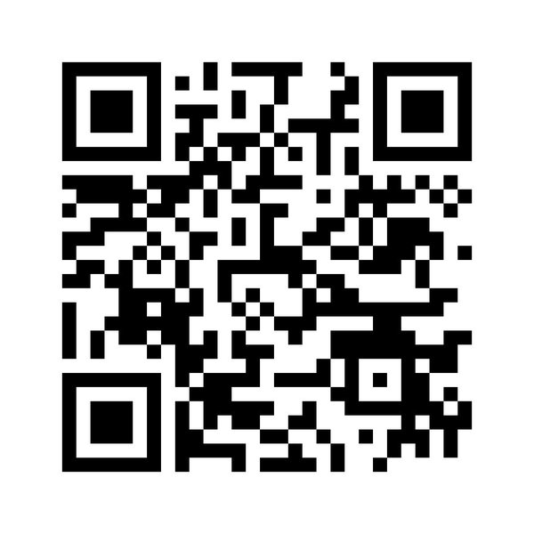

# [Twitter](https://twitter.com/NabilHassein)
This is the best way to get in touch with me if we haven't met in person,
and it's also a great way to stay up with me if we have!

I mostly post about politics,
but I'm making an effort to increase the ratio of tech content,
and particularly to focus more of my tweets on the intersection between the two.

# [Github](https://github.com/nabilhassein)
Social coding! Star my repos, send me a pull request, comment on my code with tips or questions, etc.

# [Email](mailto:nabil.hassein@gmail.com)
I'm an email hater but it's obligatory.

# [Signal](https://whispersystems.org/)
I put Signal last because I don't post my phone number publicly,
but this is **by far** the best way to reach me promptly if you know me like that.

Here's my key so you can verify you're really talking to me:

# That's about it
I struggle to keep up with too many forms of communication,
so if you invite me to connect with you in some other way and I decline,
it's not because I don't want to talk to you!
It's because I see limiting the number of forms of communication I use
as my only hope of staying on top of each one.
My apologies if I fail to reply to you despite my best efforts.

You can also reach me on any communication channels used in a private community
we are both members of, e.g. [Zulip](https://zulip.com) for the [Recurse Center](https://recurse.com).
